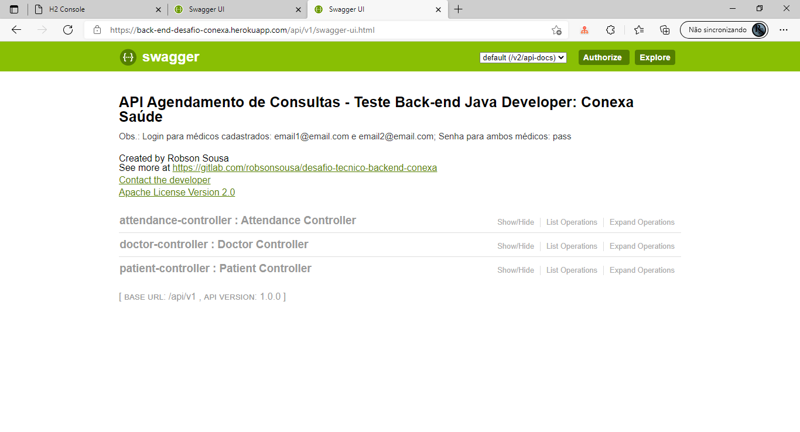
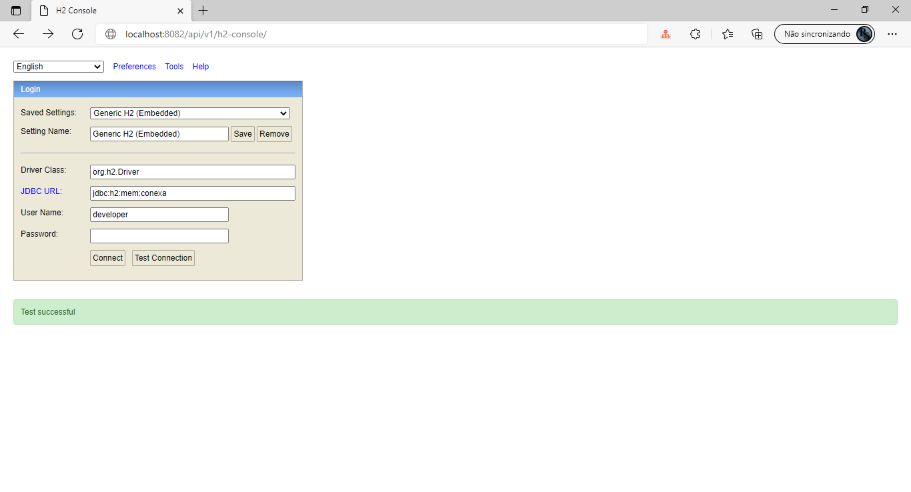
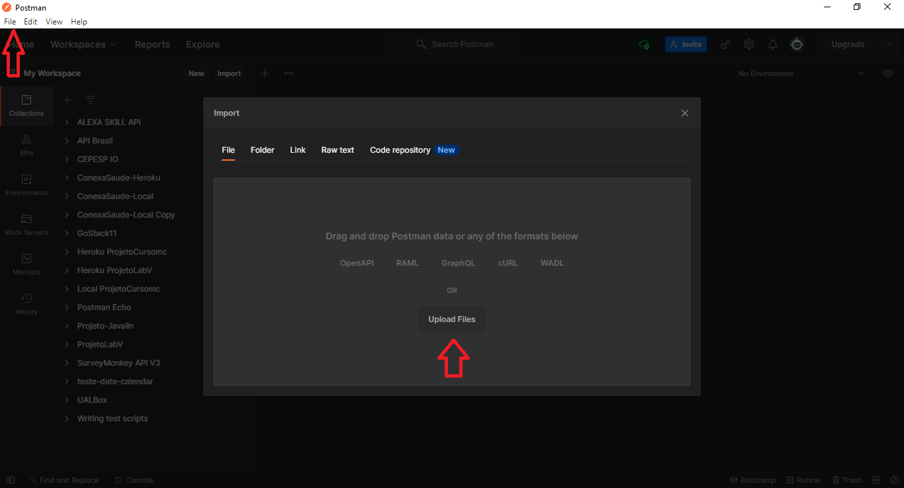

# Descrição do Projeto do Desafio Tècnico Back-end Conexa

### EXECUÇÃO REMOTO

O Back-end desse desafio está disponível na plataforma Heroku no seguinte endereço: https://back-end-desafio-conexa.herokuapp.com/api/v1

Observação: é importante considerar que a primeira requisição pode demorar alguns segundos, visto que a 
aplicação fica em estado de hibernação para economizar recursos computacionais quando não está sendo utilizada. A partir 
da 2° requisição e em um intervalo de tempo inferior a 30 a minutos entre uma requisão e outra, a resposta é imediata.

A Documentação dos Endpoints estão disponíveis no seguinte endereço: https://back-end-desafio-conexa.herokuapp.com/api/v1/swagger-ui.html

Observação: não foram criados testes automatizados. Para executar os testes, somente em ambiente local.

-----------------------------------------------------------------------------------------------------------------------

### EXECUÇÃO LOCAL

Para facilitar a execução do projeto pelos avaliadores, disponibilizei um perfil de 'Test' em que não é necessário criar
uma base de dados ou mesmo instalar um Sistema de Gerenciamento de Banco de Dados, no nosso caso o MySQL. Assim, a
aplicação acessa e cria os registros em um banco de dados em memória utilizando o H2 Memory Database. Entretanto, também é possível utilizar um banco como MySQL.

Para baixar e executar o projeto em sua máquina, primeiro faça:

git clone https://gitlab.com/robsonsousa/desafio-tecnico-backend-conexa \
Caso não possua GIT instalado, você deverá baixa-lo e instalá-lo conforme o sistema operacional que você esteja 
utilizando. Mais informações sobre GIT em: https://git-scm.com/

A Documentação dos Endpoints estão disponíveis localemente após executar o projeto e acessá-lo no seguinte endereço: http://localhost:8082/api/v1/swagger-ui.html

Para executar a aplicação você deve ter o Java Run Time instalado.
Supondo que já o tenha:

### MAVEN

Você precisára do Maven para executar o projeto e baixar as dependências do projeto caso não as tenha localmente.

Dentro da pasta raíz do projeto [desafio-tecnico-backend-conexa]() execute os seguintes comandos:

Para resolver as dependências do projeto, execute no terminal do GIT: **mvn dependency:resolve** \
Para executar o projeto atráves do Maven e utilizando o terminadl do GIT, digite: **mvn spring-boot:run** \
Para executar os testes, digite no terminal do GIT: **mvn test**

Caso não possua nem JRE ou Maven, acesse para mais detalhes de instalação:

[Java](https://www.java.com/pt-BR/download/manual.jsp) \
[Maven](https://maven.apache.org/download.cgi)

-----------------------------------------------------------------------------------------------------------------------

#### Banco de Dados em Memória (H2)

Para utilizar o banco de dados em memória basta apenas executar o projeto localmente.

Acesse o H2 através do seguinte endereço: http://localhost:8082/api/v1/h2-console/
Observações: 

* Driver Class: **org.h2.Driver**
* JDBC URL: **jdbc:h2:mem:conexa**
* User Name: **developer**
* Password: não há necessidade de senha. Portanto, deixe-a em branco.

#### Banco de Dados MySQL

Para utilizar o Banco MySQL, você deverá instalá-lo e criar uma base de dados com o seguinte nome: **conexa** \
Caso não possua o MySQL instalado, acesse o link para mais informações de instalação de acordo com o sistema 
operacional que você utiliza: https://www.mysql.com/downloads/

Caso tenha optado por utilizar o MySQL ao invés do H2. Edite o arquivo [application-properties](/src/main/resources/application.properties) 
e substitua 'test' por 'dev' na seguinte linha: spring.profiles.active=dev.

-----------------------------------------------------------------------------------------------------------------------

## POSTMAN

Na tentativa de ajudá-los com o preenchimento das requisições e respostas dos endpoints, estão disponíveis os dados em: \
[API-LOCAL](./collections-conexasaude-local/ConexaSaude-Local.postman_collection.json) \
[API-HEROKU](./collections-conexasaude-heroku/ConexaSaude-Heroku.postman_collection.json) 

Para utilizá-los, basta importa-los para o POSTMAN. Não testei no Insomnia, mas creio que deve funcionar.

Você pode gerar novos CPFs válidos para cadastro de novos médicos ou pacientes através do site: 
https://www.4devs.com.br/gerador_de_cpf

Cordialmente,
Robson Sousa

